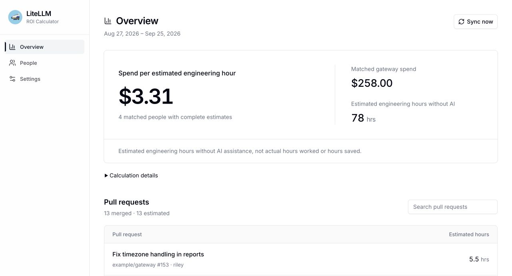
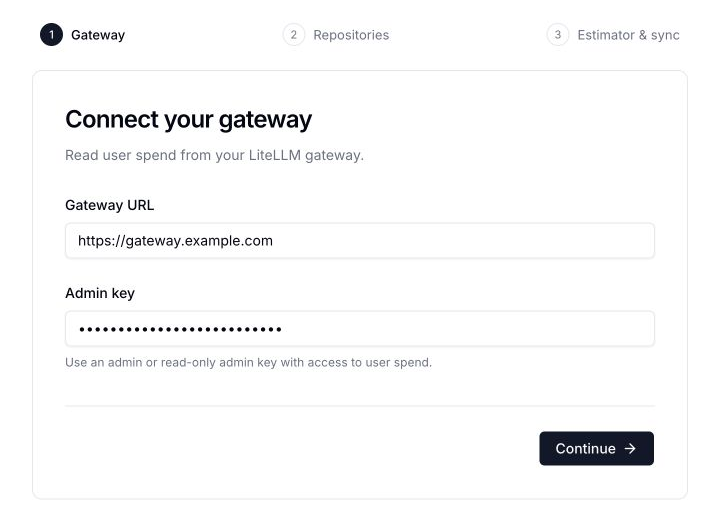
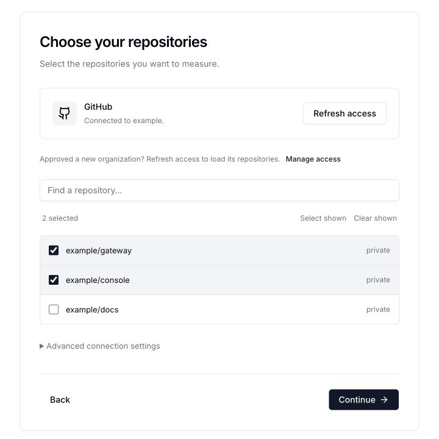
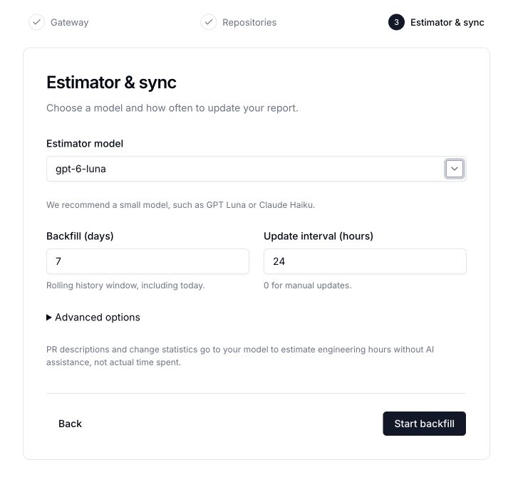
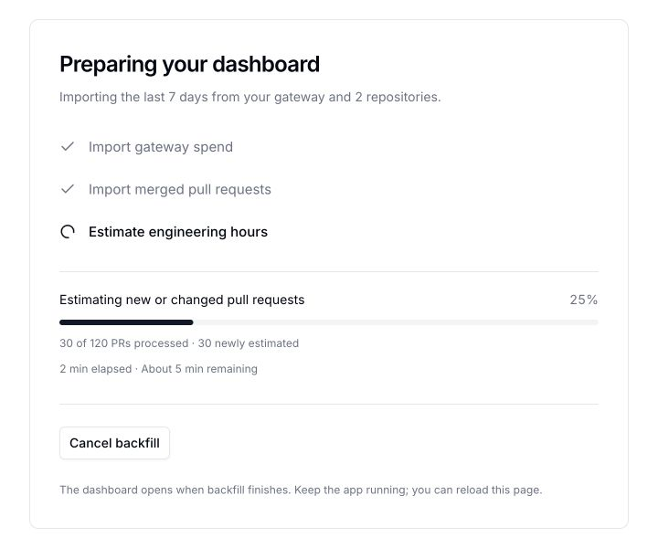

# LiteLLM ROI Calculator

Connect your LiteLLM gateway and GitHub repositories to compare **AI spend with estimated engineering hours without AI assistance**.

The calculator reads spend per user, estimates the work in merged PRs with a model you choose, and matches people by email. These are estimates of engineering effort—not actual hours worked, hours saved, or a claim of financial return.



*All screenshots use sample data.*

## Start locally

You need **Python 3.11+**, [uv](https://docs.astral.sh/uv/getting-started/installation/), a LiteLLM gateway, and access to the GitHub repositories you want to measure.

```bash
git clone https://github.com/BerriAI/litellm-roi-calculator.git
cd litellm-roi-calculator
uv run litellm-roi
```

The app opens at **http://localhost:8787**. No database server, Node installation, or frontend build is required.

[Use Docker or pip, or explore a demo without credentials →](docs/running.md)

## 1. Connect your gateway

Enter your **gateway URL** and an **admin or read-only admin key** that can read users and spend. Click **Continue** to test the connection.



If your read-only key cannot call models, add a separate inference key under **Advanced options** in step 3. A dedicated service user also keeps the calculator’s estimation costs separate from engineers’ spend.

## 2. Connect GitHub and choose repositories

Click **Connect GitHub**. GitHub walks you through creating a read-only App for this calculator and choosing which repositories it can access. Return to the calculator and select your repositories—there are no client IDs or secrets to copy.



- **Company repositories:** choose your organization in **GitHub account**. If GitHub requires approval, ask an organization owner to approve it, then click **Check access** or **Refresh access**.
- **Use the upstream repository:** select `BerriAI/litellm` if that is where PRs are merged. A personal fork does not inherit its upstream PR history.
- **More control:** use **Manage access** to change GitHub permissions. Tokens and GitHub Enterprise Server are under **Advanced connection settings**.

Click **Continue**. [Company and Enterprise connection details →](docs/reference.md#company-github-connections)

## 3. Choose a model and schedule

Select a model from your gateway, or type its deployment name. We recommend a small model such as **GPT Luna or Claude Haiku**.



| Setting | Default | What it controls |
| --- | --- | --- |
| Backfill | **7 days** | The rolling history window, including today |
| Update interval | **24 hours** | How often the running app refreshes; `0` means manual updates |
| Prompt | Built in | Editable under **Advanced options** |

The default prompt is:

> Estimate how many hours it would take an engineer to complete the work in this pull request without AI assistance. Explain your estimate briefly.

Temperature is fixed at **0**. The model receives PR descriptions, file change counts, and commit metadata. Code patches are excluded. You can change the model, prompt, backfill, and schedule later in **Settings**.

## 4. Start backfill

Click **Start backfill**. The app imports gateway spend and merged PRs, then estimates up to three PRs at a time. Progress shows the PR count, elapsed time, and an approximate time remaining once enough work has completed.



The dashboard opens when backfill finishes. Keep the app running; you can close or reload the browser.

After setup, it refreshes on your schedule. **Unchanged, successfully estimated PRs are reused before downloading their details or calling the model.** New or changed PRs are processed, and failed estimates are retried. Progress distinguishes reused PRs from new estimates. Completed PRs are cached individually, so cancelling a backfill does not throw away their estimates.

## Read your report

- **Overview:** matched gateway spend divided by estimated engineering hours without AI. Click a PR to inspect its estimate and reasoning.
- **People:** spend and estimated hours per person. Matching uses the same email on the gateway and GitHub. Use **Match email** when GitHub hides an email or someone uses a different address.
- **Calculation details:** shows matched coverage and spend excluded from the comparison. The main spend card includes matched people; it is not the gateway’s entire spend.
- **Settings:** change connections, repositories, model, prompt, and sync schedule. **Advanced settings → Restart setup** clears reports and repository selections while keeping saved connections and cached estimates.

For example, the sample report above compares **$258 of matched spend ÷ 78 estimated hours = $3.31 per estimated hour**. It does not say that AI saved 78 hours. Each person’s gateway spend includes all their usage, rather than costs attributed to a specific PR.

[How estimates, matching, and caching work →](docs/reference.md#what-the-dashboard-calculates)

## Host it for your team

[Deploy to Render](https://render.com/deploy?repo=https://github.com/BerriAI/litellm-roi-calculator) with the included blueprint, then follow the same setup steps. Use one instance and a persistent disk for settings and reports.

This is one shared workspace with **no built-in dashboard login**. Add your hosting provider’s access controls or an SSO proxy before sharing company data. GitHub connects repositories; it does not restrict who can open the dashboard. Anyone who can reach an unprotected deployment can view reports, change settings, and start syncs.

Keys stay on the server and are never returned by the API. Stored keys are plaintext files with owner-only permissions; server administrators can read them. PR metadata is sent to your chosen model through your gateway.

[Render, data storage, environment variables, and development →](docs/reference.md)

## License

Apache 2.0. LiteLLM UI components and logos retain their MIT notice. See [THIRD_PARTY_NOTICES.md](THIRD_PARTY_NOTICES.md).
